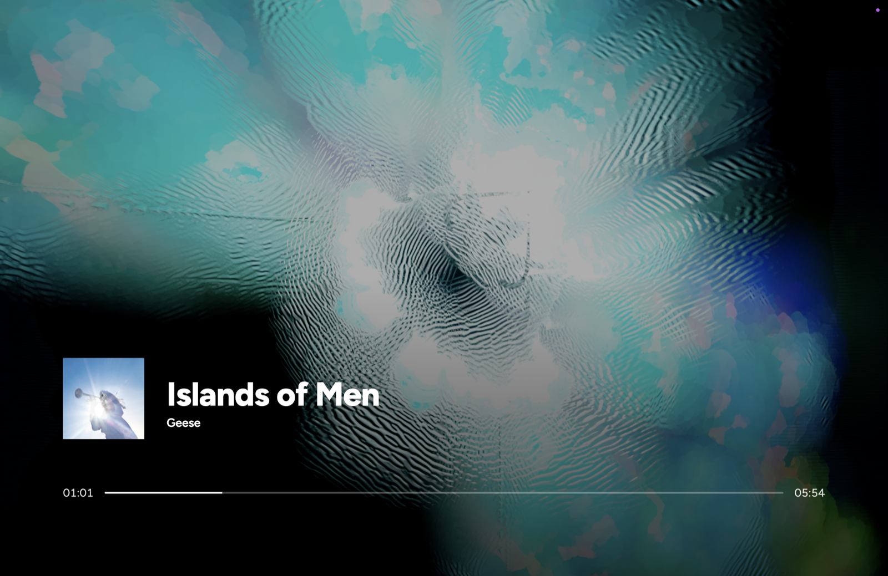
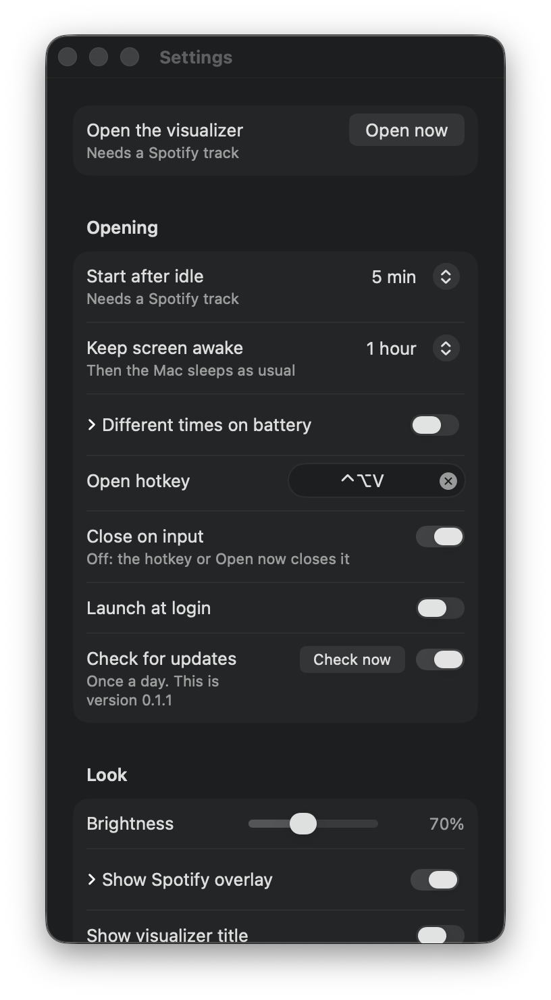

# IdleViz

**A fullscreen music visualizer for Spotify, on macOS and Windows, that opens when your computer goes idle.**

[Features](#features) · [Screenshots](#screenshots) · [Install](#install) · [Usage](#usage) · [Custom visualizers](#custom-visualizers) · [Documentation](#documentation)

IdleViz turns a Mac or a Windows PC into a music display. When the computer goes idle, or when you press a hotkey, it opens a fullscreen [Butterchurn](https://github.com/jberg/butterchurn) visualizer that reacts to Spotify's audio, with a now-playing overlay styled after the Spotify TV app. Any mouse or key input closes it.

It is not a real screensaver, just a fullscreen window on top of everything. It sits in the menu bar on the Mac and in the tray on Windows, and both apps show the same visualizer, presets and overlay.

> **Status: in development.** Both apps have every feature below. On the Mac, covering more than one display has not been checked with a real second display yet, and on Windows the battery times have only been checked with a pretend battery.

## Features

- **Opens by itself.** After 5 idle minutes (or 10, 15, 30, or never), from a global hotkey, or from the URL `idleviz://open`, and only while Spotify has a track loaded.
- **Stays out of the way.** Any input closes it and returns you to the app you were in. It doesn't open on idle while the screen is locked or a video or call is running.
- **Reacts to Spotify only.** The visuals follow Spotify's audio, never the microphone or other apps, and only while the window is open.
- **Now playing.** Album art, title, artist and progress, styled after the Spotify TV app. No Spotify login and no web API.
- **395 presets.** Butterchurn (WebGL Milkdrop) presets, shuffled with a blend between them, or one fixed preset. Favorites, a blocklist, and keys to like, skip and block while it's showing.
- **Your own visuals.** Drop Butterchurn `.json`, Milkdrop `.milk` or custom `.js` plugin files into the presets folder. Plugins run in a sandbox.
- **Audio sync.** A delay for Bluetooth and network speakers, saved per device and measured with the microphone or by ear.
- **More than one display.** The same visualizer on each display, or one picture extended across them.
- **Keeps the screen awake.** Up to a limit you set, then it fades out and the computer sleeps as usual. Separate times on battery.
- **Update notice.** Tells you when a newer release is out. It downloads and installs nothing.

Every setting and what differs between the two apps is in [docs/usage.md](docs/usage.md).

## Screenshots

   
  <em>The visualizer with the now-playing overlay</em>

The visualizer is the same page in both apps. The windows around it are native, so they look different on each.

### macOS

   
  <em>The settings window</em>

### Windows

Screenshots of the Windows app are still to come.

<!-- Add when taken on a Windows PC:

   
  <em>The settings window</em>

-->

## Install

Both apps need the Spotify desktop app. Downloads are on the [Releases page](https://github.com/Xauno/IdleViz/releases).

### macOS

Needs macOS 26 or later, on Apple silicon or Intel.

1. Download `IdleViz.dmg`, open it and drag **IdleViz** onto **Applications**. Releases up to v0.1.1 have no disk image, so until the next one, [build it yourself](docs/building.md#build-the-mac-app).
2. The app isn't notarized, so macOS blocks it the first time. Open it, click **Done**, then go to System Settings → Privacy & Security and click **Open Anyway**.
3. A welcome window asks for two permissions: controlling Spotify (used only to read what's playing) and recording system audio (Spotify's audio only, while the visualizer is open).

### Windows

Needs Windows 11.

1. Download `IdleViz-Setup.exe` and run it. It isn't signed, so SmartScreen warns: choose **More info**, then **Run anyway**.
2. Follow the wizard. It installs for your user only, with no admin prompt.

Updating, uninstalling and what to do when a permission is missing are in [docs/usage.md](docs/usage.md#installing-and-updating).

## Usage

IdleViz has no window of its own. Click its icon in the menu bar (Mac) or the tray (Windows) for **Settings**.

| To                     | Do this                                                                         |
| ---------------------- | ------------------------------------------------------------------------------- |
| Open the visualizer    | ⌃⌥V on the Mac, Ctrl + Alt + V on Windows, or **Open now** in settings          |
| Close it               | Move the mouse, click, scroll or press a key                                    |
| Keep it open           | The playback and volume keys don't close it                                     |
| Like the preset        | **L** adds it to your favorites                                                 |
| Skip the preset        | **N** blends to the next one                                                    |
| Block the preset       | **B** leaves it out of shuffle                                                  |
| Change when it opens   | **Start after idle** under **Opening** in settings                              |
| Add your own presets   | **Import…** under **Presets** in settings                                       |
| Fix sound running late | **Audio delay** under **Audio sync** in settings                                |

Spotify has to be running with a track loaded, playing or paused. If it isn't, the icon flashes and nothing opens. A yellow icon means something is wrong; click it to see what.

The full guide is [docs/usage.md](docs/usage.md).

## Custom visualizers

You can add your own visuals without touching either app. The easiest way is a single `.js` file that draws into a canvas and receives Spotify's audio levels every frame. [`aurora.js`](web/visuals/aurora.js) is a complete working example, and the guide is [docs/custom-visualizer.md](docs/custom-visualizer.md).

## How it works

One borderless window holds one web page: the Butterchurn canvas, a dim layer and the overlay. It is the same page in both apps, in a WKWebView on the Mac and in WebView2 on Windows. A native helper around it (Swift on the Mac, C# with WinUI 3 on Windows) watches for idle time and hotkeys, reads what's playing, captures Spotify's audio and sends the analysis to the page about 60 times a second.

## Documentation

| Document                                               | What's in it                                                     |
| ------------------------------------------------------ | ---------------------------------------------------------------- |
| [docs/usage.md](docs/usage.md)                         | Every setting, and how the Mac and Windows apps differ           |
| [docs/custom-visualizer.md](docs/custom-visualizer.md) | Writing a visualizer plugin                                      |
| [docs/building.md](docs/building.md)                   | Building from source, development, CI, releases, project layout  |
| [docs/roadmap.md](docs/roadmap.md)                     | The steps each app was built in                                  |
| [project.md](project.md)                               | The design and the decisions behind it                           |
| [docs/windows.md](docs/windows.md)                     | How the Windows app is built                                     |
| [CONTRIBUTING.md](CONTRIBUTING.md)                     | The pull request workflow                                        |

## License

[MIT](LICENSE). Butterchurn, the bundled preset packs and the Milkdrop converter are MIT licensed too; their license files are in [web/vendor/](web/vendor/). Presets and plugins that you import yourself keep their own licenses.

## Credits

- [Butterchurn](https://github.com/jberg/butterchurn), [butterchurn-presets](https://github.com/jberg/butterchurn-presets), [milkdrop-preset-converter](https://github.com/jberg/milkdrop-preset-converter) and [Milkdrop](https://www.geisswerks.com/milkdrop/), the visualizer engine and the presets it plays
- [KeyboardShortcuts](https://github.com/sindresorhus/KeyboardShortcuts) for the global hotkey on the Mac
- [H.NotifyIcon](https://github.com/HavenDV/H.NotifyIcon) for the tray icon, and the [Windows Community Toolkit](https://github.com/CommunityToolkit/Windows) for the settings cards, on Windows
- [Figtree](https://github.com/erikdkennedy/figtree) for the overlay font
